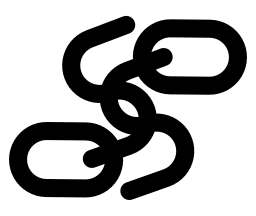

# SSURLSS

##### super simple URL shortener service

 

A very lightweight URL shortener.

## Usage

### Standalone

You can use ssurlss standalone by manually compiling & installing it in a directory. Running it for the first time will generate the `ssurlss.toml` config file, which can be edited, and the changes will take affect once ssurlss is restarted.

### Docker

You can build the docker image using supplied `docker-compose.yml` using `docker-compose up` in a clone of this repo, or change the `build: .` to `build: https://github.com/Hoverth/ssurlss.git` to keep your directory clean.

## Configuration

There are several options to configure ssurlss, which can both be controlled via changes in the config, or set via environment variables (which override the config file configuration).

The following list is formatted as 
```
- toml_name (ENVNAME, `default value`) Notes
```


- host (HOST, `"http://localhost:8000"`) only really needed if allowing new entries
- url_path (URLPATH, `""`) The path that the application should use, e.g. `<host>/ssurlss/<subpaths>`
- link_path (LINKPATH, `"links"`) The subpath that links should use, e.g. `<host>/link/<entry id>`
- port (PORT, `8000`) The port for the server to listen on, if using in docker just set the mapped port in the `docker-compose.yml`
- allow_new (ALLOWNEW/DISALLOWNEW, `true`) Setting either envvar to 1 will set the relevant value in the config.
- entries_len (no envvar, `0`) A helpful tracking value for admin purposes, no environment variable and not used anywhere (write-only).


## License

This project is licensed under the AGPL v3. See `LICENSE` for details.
